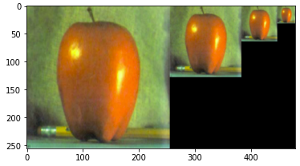

# Image Processing

This is the repository of the first homework proposed for the course of *Vision and Perception*.

It contains solutions of four assignments intended to master skills in Image Processing:
1. **Feature Detection and Description**
2. **Segmentation and Optical Flow**
3. **Texture Gradients**
4. **Lower Resolution**

Code implementations (in Python) for all of them are collected in the [scripts](https://github.com/olga-sorokoletova/Vision-and-Perception/tree/main/Homework%201/scripts) folder.

## Assignment 1: Feature Detection and Description

### Task Assignment

Starting from the Bag of Visual Words algorithm with **SIFT**, implement **Harris** Feature Extractor **and another method at your choice**. Compare SIFT with Harris and SIFT with the new method. Report the features extraction phase and discuss the results. Show the extracted features using the three different methods on sample image from the dataset. Furthermore, the three confusion matrices as output of the BOW algorithm must be provided. The dataset was provided in the assignment, and test part of it is uploaded into current repository in [Dataset/test](https://github.com/olga-sorokoletova/Vision-and-Perception/tree/main/Homework%201/Dataset/test).
___

### Implementation

**Code:** [```feature_detection_and_description.ipynb```](https://github.com/olga-sorokoletova/Vision-and-Perception/blob/main/Homework%201/scripts/feature_detection_and_description.ipynb)

**Pre-processing:** Decision to work in a gray-scale has been taken to reach consistency between methods since ```cv2.cornerHarris()``` functions takes as input images in a gray-scale. Images are resized to the (150, 150) dimension.

**Harris:** Since Harris is just a Feature Extractor, but combining of it with the SIFT Descriptor is not desirable, another approach has been developed – Descriptor List is filled directly with the extracted and refined corners (Open-CV tutorial recommends function ```cv2.cornerSubPix()``` which refines the corners detected with sub-pixel accuracy. For this we pass the centroids of the Harris corners and have to define the criteria when to stop the iteration).

**BRISK:** The method implemented as a method at choice was BRISK (Binary Robust Invariant Scalable Key points). BRISK has a handmade sampling pattern. Gaussian filter is applied to different regions separately. Additionally, threshold distinguishes patterns into short, long and unused pairs. Wherein, short hand distance pairs are used to compute intensity values, whereas long hand distance pairs are used to find orientation. BRISK, as well as SIFT, contains both Detector and Descriptor, and is provided with the same methods to call.
___

### Results

Extracted features for the randomly sampled from the dataset and pre-processed image are shown below and can be found in the [```feature_detection_and_description.ipynb```](https://github.com/olga-sorokoletova/Vision-and-Perception/blob/main/Homework%201/scripts/feature_detection_and_description.ipynb) as well as confusion matrices and other information regarding to
performance of the methods. 

<p align="center">
  
  
  
</p>

**Trainin Time:** Harris is the fastest method (1-1.5 mins), although it is influenced by the absence of the descriptors computation after extracting Harris corners. Training time of the BRISK is compatible with the one of SIFT, but in general the latter executes faster (8 vs 5 mins), despite on the fact that BRISK is considered to be a high-speed method, meanwhile SIFT – the method of a moderate speed. Probably, that’s a matter of this particular dataset.

**Accuracy:** On the given dataset in average SIFT reaches about 0.5-0.6 value of accuracy, BRISK – 0.4-0.5, and Harris – 0.3-0.4. 

**Confusion Matrices:** Harris stably is able to recognize at some level ```cities``` and ```faces```, doing some work on the recognizing of the ```offices``` and ```house buildings```, but is not able to tell anything about some other classes. In particular, it has problems with images, semantics of which is not well-defined by the corners, e.g. ```sea``` or ```green```, or with images, for which corner features are not that useful for distinguishing because of similarity of the corner patterns between the classes, e.g. ```house indoor``` has approximately equal probabilities to be identified as ```house indoor```, ```city```, ```office``` or ```house building```. But ```house indoor``` is a problematic category for all of the three algorithms and further work should focused on this aspect. In other categories, both BRISK and SIFT keep more uniform distribution of guesses, but it is noticeable that SIFT performs generally better, and the reason is seen on the sampled image: BRISK tends to ignore border areas of an image. 

**Properties:** Both BRISK and SIFT are invariant to the translation, but BRISK performs better for view point change. SIFT is robust to shifts/translations/any spatial modifications and performs the best on the given dataset, but precise investigation of the SIFT’s results on the sampled images shows a weak ability to handle orientation and illumination.

## Assignment 2: Segmentation and Optical Flow

### Task Assignment

Write a code to **segment simple shapes** (the images are given: [im1](https://github.com/olga-sorokoletova/Vision-and-Perception/blob/main/Homework%201/images/im1_11.jpg), [im2](https://github.com/olga-sorokoletova/Vision-and-Perception/blob/main/Homework%201/images/im2_11.jpg), [im3](https://github.com/olga-sorokoletova/Vision-and-Perception/blob/main/Homework%201/images/im3_11.jpg)) showing the reasoning behind your choices. Discuss the limits and strengths of your proposed approach. Then exploiting **the Optical Flow algorithm** on the given images, define which object that you segment with the previous code is moving to the center and which is diverging to the borders. Discuss and report the estimated optical flow usage.
___

### Implementation

**Code:** [```segmentation_and_optical_flow.ipynb```](https://github.com/olga-sorokoletova/Vision-and-Perception/blob/main/Homework%201/scripts/segmentation_and_optical_flow.ipynb)

**Watershed Algorithm:** Marker-based image segmentation using Watershed algorithm has been chosen. The given images are represented in a gray-scale. Meanwhile, any gray-scale image can be viewed as a topographic surface where high intensity denotes peaks and hills while low intensity denotes valleys. If we flood this surface from its minimum and prevent the merging of the waters coming from different sources, we partition the image into two different sets: the catchment basins and the watershed lines. Hence, this methods is suitable for the simple geometric forms segmentation.

**Optical Flow:** Optical Flow arises from the relative motion of objects and the viewer. In this assignment Gunnar Farneback algorithm to determine Dense Optical Flow in a set of three images (frames) has been implemented. Algorithm uses a mask to combine calculated Optical Flow and original images. HSV color format is considered. Then, hue indicates the direction in which the object is moving, and the value indicates how fast it is going. Hue and value are set according to magnitude and angle. Parameters are chosen using some optimization suggestions form the ```cv2.calcOpticalFlowFarneback()``` documentation.
___

### Results

1. **Image Segmentation with Watershed Algorithm** for the given images is shown below and can be also found in the [```segmentation_and_optical_flow.ipynb```](https://github.com/olga-sorokoletova/Vision-and-Perception/blob/main/Homework%201/scripts/segmentation_and_optical_flow.ipynb).

<p align="center">
  
</p>

**Limits and Strengths of Watershed Algorithm:** Watershed is the most simple and intuitive in usage method. Furthermore, it is fast and computationally efficient. Is able to provide closed contours and produce a complete division of the image in separated regions. The main drawback is that it gives an over-segmented (over-segmentation refers to the over-cutting) result considering noise or any other irregularities in the image that are common for all applications. This means that fragments of the interest might be omitted from the segmentation result. From the another side, under-segmentation (leaking) also occurs.

2. **Dense Optical Flow** for the given images **(Frame 1 -> Frame 2 and Frame 2 -> Frame 3)** is shown below and can be also found in the [```segmentation_and_optical_flow.ipynb```](https://github.com/olga-sorokoletova/Vision-and-Perception/blob/main/Homework%201/scripts/segmentation_and_optical_flow.ipynb).

<p align="center">
  
</p>

**Flow:** Triangle is moving to the center, square is diverging to the borders.

## Assignment 3: Texture Gradients

### Task Assignment

Taking two given images ([im1](https://github.com/olga-sorokoletova/Vision-and-Perception/blob/main/Homework%201/images/im1_12.jpg), [im2](https://github.com/olga-sorokoletova/Vision-and-Perception/blob/main/Homework%201/images/im2_12.jpg)), **compute and discuss the Texture Gradients**. Which filters perform better on which effects?
___

### Implementation

**Code:** [```texture_gradients.ipynb```](https://github.com/olga-sorokoletova/Vision-and-Perception/blob/main/Homework%201/scripts/texture_gradients.ipynb)

**Filters:** Vertical/Horizontal/Combined Sobel and Laplacian of Gaussian filters were used to compute gradients (second derivatives in the case of Laplacian). 

**Sobel:** Sobel is the operator which consists on the pair of 3×3 convolution kernels. Convolution is done by moving the kernel across the frame one pixel at time. This is fast to compute and usually is used to detect the thicker edges only (horizontal and vertical gradients). Sobel Filter cannot detect the diagonal edges. Kernels are designed to respond maximally while running vertically and horizontally along the pixel grid. In other cases 0 is taken to show the maximum contrast from black to white. The Sobel operator performs a 2D spatial gradient measurement on an image and emphasizes regions of high spatial frequency that correspond to edges. Typically, it is used to find the approximate absolute gradient magnitude at each point in an input gray-scale image. 

**Laplacian:** A Laplacian filter is an edge detector used to compute the second derivatives of an image, measuring the rate at which the first derivatives change. The Laplacian is often applied to an image that has been smoothed with something approximating a Gaussian smoothing filter in order to reduce its sensitivity to noise. The operator normally takes a single grey-level image as input and produces another grey-level image as output.
___

### Results

1. Results of the apllication of the filters for the [**im1**](https://github.com/olga-sorokoletova/Vision-and-Perception/blob/main/Homework%201/images/im1_12.jpg) are shown below and can be also found in the [```texture_gradients.ipynb```](https://github.com/olga-sorokoletova/Vision-and-Perception/blob/main/Homework%201/scripts/texture_gradients.ipynb). **Combined Sobel** has the best performance by highlighting both horizontal and vertical patterns.

<p align="center">
  
</p>

2. Results of the apllication of the filters for the [**im2**](https://github.com/olga-sorokoletova/Vision-and-Perception/blob/main/Homework%201/images/im2_12.jpg) are shown below and can be also found in the [```texture_gradients.ipynb```](https://github.com/olga-sorokoletova/Vision-and-Perception/blob/main/Homework%201/scripts/texture_gradients.ipynb). The image is noisier, and Sobel starts to react weaker than **Laplacian**.

<p align="center">
  
</p>

## Assignment 4: Lower Resolution

### Task Assignment

Discuss and implement at least two algorithms to **decrease the size** of an image with a minimum content loss.
___

### Implementation

**Code:** [```lower_resolution.ipynb```](https://github.com/olga-sorokoletova/Vision-and-Perception/blob/main/Homework%201/scripts/lower_resolution.ipynb)

**Algorithm 1:** Gaussian Pyramid - a technique in Image Processing that breaks down an image into successively smaller groups of pixels to blur it.

**Algorithm 2:** MIPMAP - a sequence of textures, each of which is a progressively lower resolution representation of the same image.
___

### Results

1. **Gaussian Pyramid** for the [**apple**](https://github.com/olga-sorokoletova/Vision-and-Perception/blob/main/Homework%201/images/apple.png) image is shown below and can be also found in the [```lower_resolution.ipynb```](https://github.com/olga-sorokoletova/Vision-and-Perception/blob/main/Homework%201/scripts/lower_resolution.ipynb).

<p align="center">
  
</p>

2. **MIPMAP** for the [**apple**](https://github.com/olga-sorokoletova/Vision-and-Perception/blob/main/Homework%201/images/apple.png) image is shown below and can be also found in the [```lower_resolution.ipynb```](https://github.com/olga-sorokoletova/Vision-and-Perception/blob/main/Homework%201/scripts/lower_resolution.ipynb). Image quality is improved by countering the aliasing that is caused by the under-sampling of textures that do not use mipmapping.

<p align="center">
  
</p>


## Author

- Olga Sorokoletova - 1937430

