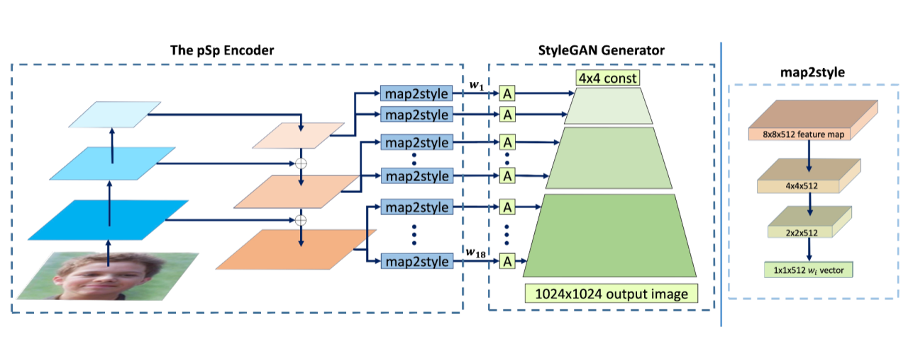

# StyleGAN encoder for image-to-image translation

This is the repository of the final project proposed for the course of *Vision and Perception*.

This work is intended to master skills in Deep Learning for Computer Vision and is centered on the idea of developing the generic **pixel2style2pixel(pSp)** framework presented in the paper [Richardson et al, **"Encoding in Style: a StyleGAN Encoder for Image-to-Image Translation,"** (IROS 2016)](https://arxiv.org/abs/2008.00951) and aplicable  on a large variety of **image-to-image translation** tasks among which the current project is focused on GAN Inversion. It is implemented in Tensorflow.

## The pSp Framework

Given an input image, **x**, the output of the model is defined as:

$$pSp(\mathbf{x}) := G(E(\mathbf{x}) + \mathbf{\bar{w}})$$

where $E(·)$ and $G(·)$ denote the novel pSp encoder with a FPN architecture that generates style vectors directly in extended latent space $\mathit{W}+$ and a pretrained StyleGAN generator, respectively. The encoder aims to learn the latent code with respect to the average style vector $\mathbf{\bar{w}}$.

The complete architecture is illustrated in image below:

  

Feature maps are first extracted using a standard feature pyramid over a ResNet backbone. For each of the
$18$ target styles, a small mapping network is trained to extract the learned styles from the corresponding feature map, where styles ($0-2$) are
generated from the small feature map, ($3-6$) from the medium feature map, and ($7-18$) from the largest feature map. The mapping network,
*map2style*, is a small fully convolutional network, which gradually reduces spatial size using a set of $2$-strided convolutions followed by
LeakyReLU activations. Each generated $512$ vector, is fed into StyleGAN, starting from its matching affine transformation, $\mathit{A}$.

## Authors
- Olga Sorokoletova - 1937430
- Amila Sikalo - 1938032
